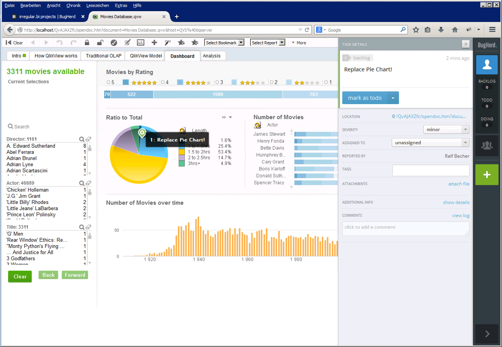

QlikView Extensions BugHerd
===========================

This document extension integrates BugHerd (www.bugherd.com) Sidebar for visual bug tracking into your QlikView web session.

Note: 
Set your BugHerd API key into QlikView variable vBugHerdApiKey. Then log into BugHerd.com in the same browser session. Press F5 to refresh QlikView Sheet to display BugHerd sidebar.

